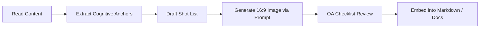

# Ian Xiaohei Illustrations (English-only)

Editorial-style hand-drawn illustrations for technical and design documentation. Each image visualizes one cognitive anchor (a mechanism, turning point or metaphor), with Xiaohei doing the core conceptual work. Never add Chinese characters, Hanzi or any Asian script.

## 2. Visual DNA & Guidelines

| Element | Specification |
| :--- | :--- |
| **Canvas** | `16:9` widescreen aspect ratio |
| **Background** | Pure white (`#FFFFFF`). No paper texture, gradients, shadows, or background scenery |
| **Line Work** | Black hand-drawn sketchy pen lines with natural slight wobble |
| **Whitespace** | At least **35%–50%** empty margin space around subjects |
| **Accent Colors** | **Orange**: Main flow, directional arrows, energy conduits.<br>**Blue**: Status notes, system state, secondary feedback.<br>**Red**: Critical warnings, bottlenecks, or problem states |
| **Annotations** | Short handwritten **English labels only** (2–5 words max). **Strictly NO Chinese characters or Hanzi** |
| **Forbidden Elements** | Chinese/Asian script, corporate PPT graphics, isometric 3D blocks, kawaii/chibi cartoons, complex UI mockups, dense text blocks |

---

## 3. The Recurring IP: "Xiaohei"

Xiaohei is **not** a mascot or corner ornament. Xiaohei is a dedicated, slightly bizarre worker operating the underlying machinery:
* **Appearance**: Oval or rounded solid black silhouette, tiny white dot eyes, thin stick arms and legs, deadpan expression.
* **Role**: Must perform the core conceptual action (turning cranks, routing cables, inspecting packages, bridging gaps).
* **Tone**: Serious, deadpan, surreal, and matter-of-fact in absurd situations.

---

## 4. Agent Workflow

When generating illustrated documentation:



### Step 1: Content Ingestion & Cognitive Anchors
Identify which parts of the documentation actually benefit from a visual metaphor (e.g., state synchronization, role separation, life-cycle transitions). Avoid illustrating trivial paragraphs.

### Step 2: Shot List Planning
Create a concise shot list outlining:
* Insertion point (which section)
* Core message / metaphor
* Xiaohei's action
* Proposed English handwritten labels (no Chinese)

### Step 3: Image Generation Prompt Template
Use the built-in image generator with `16:9` ratio and following prompt blueprint:

```text
Generate one standalone 16:9 horizontal minimalist article illustration.

Visual DNA:
Pure white clean background. Minimalist black hand-drawn ink pen line art. Slightly wobbly sketchy lines. Generous empty white space. Clean absurd product-sketch aesthetic. No gradients, no shadows, no paper texture, no commercial vector art, no corporate PPT infographic look, no cute kawaii cartoon.

Recurring IP character:
Xiaohei, a small solid-black silhouette creature with tiny white dot eyes, thin stick legs, blank serious deadpan expression. Xiaohei performs the core conceptual action: [describe action, e.g. turning a crank that broadcasts signals to multiple screens].

Theme:
[Doc Section Theme]

Core idea:
[Key takeaway]

Suggested elements:
[Element 1] / [Element 2] / [Element 3]

English handwritten labels:
[Label 1] / [Label 2] / [Label 3]

Color use:
Black for line art and Xiaohei figures, crisp orange accent for flow lines, blue/red for status notes.

Constraints:
Strictly English text only. Do NOT use any Chinese characters, Hanzi, or Asian script. Preserve over 40% blank white margin. Sparse handwritten English annotations. No corner headers.
```

### Step 4: QA Checklist
Reject and regenerate an image if any of these fail:
* No Chinese characters, Hanzi, Asian script or non-English text artifacts anywhere.
* Pure white background; no gradients, shadows, paper texture or scenery.
* 16:9 widescreen, with at least 35%–50% empty white space.
* Xiaohei performs the core action (not a mascot in the corner).
* Only orange (flow), blue (state) and red (problems) as accents.
* 2–5 word handwritten English labels; no dense text, no corner headers.
* No isometric 3D blocks, PPT graphics, kawaii/chibi style or complex UI mockups.

### Step 5: Asset Organization
Save generated illustrations into:
```text
assets/<slug>-illustrations/
  01-topic-name.jpg
  02-topic-name.jpg
```
For Torneio ILOG, save images to `docs/assets/illustrations/` using the file names, target sections and prompts listed in GitHub issue #10 (copied from the CarCity skill; same style as the CarCity docs). Embed each image right below the target section heading, e.g. `` in `docs/regras.md`, and tick it off in the issue.
