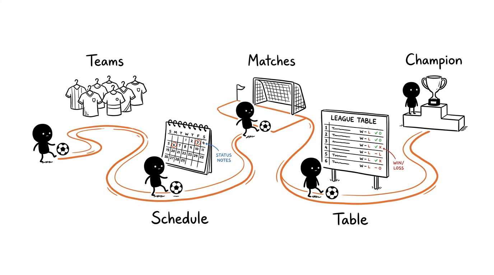

# Torneio ILOG 🏆⚽

Aplicação web para organizar torneios desportivos entre amigos: equipas, plantéis, calendário, resultados ao vivo, eliminatórias, estatísticas de jogadores e jogos singulares. Todos os telemóveis ligados veem as alterações no mesmo instante, sem recarregar a página.

Atualmente focada em futebol, com um [plano para suportar qualquer desporto](docs/novas-funcionalidades.md) — padel 🎾, basquetebol 🏀, andebol 🤾, voleibol 🏐 e outros — através de perfis de desporto.

**App:** <https://dioogomartiins.github.io/torneio-ilog/>

## ✨ O que faz



- **Calendário automático** pelo Algoritmo de Berger, com 1 a 8 grupos, várias voltas e volta extra.
- **Resultados ao vivo**: estado do jogo (agendado, a decorrer, terminado), marcadores, assistências e MVP, com uma janela por jogo e animações de golo em todos os telemóveis.
- **Classificação** com pontos configuráveis, bónus por goleada e desempate por confronto direto.
- **Eliminatórias** (mata-mata) geradas a partir da classificação, com penáltis.
- **Jogo Singular**: escolhes quem está presente e a app divide os jogadores em duas equipas equilibradas pelo rating.
- **Estatísticas e Ficha de Jogador** com golos, assistências e MVPs de sempre.
- **Histórico**: cada torneio terminado é arquivado com a tabela final e o campeão.
- **Partilhar como imagem** a classificação ou um resultado (WhatsApp, etc.).
- **Contas Google com perfis**: quem não entra só vê; cada alteração fica registada com quem a fez.
- Tema claro e escuro, pensado para usar no telemóvel durante os jogos.

## 📚 Documentação

| Documento | Para quem | Conteúdo |
|---|---|---|
| [Guia de Utilização](docs/guia.md) | Quem usa a app | Perfis, como montar e jogar um torneio, jogo singular, histórico, dados |
| [Regras e Cálculos](docs/regras.md) | Quem quer perceber os números | Pontuação, desempates, calendário, eliminatórias, ratings, equipas equilibradas |
| [Instalação e Publicação](docs/configuracao.md) | Quem mantém a app | Firebase, `.env`, correr localmente sem tocar no torneio real, deploy do site e das regras |
| [Arquitetura](docs/arquitetura.md) | Quem altera o código | Módulos, modelo de dados, sincronização, permissões, testes |
| [Novas Funcionalidades](docs/novas-funcionalidades.md) | Quem quer contribuir | Plano multi-desporto: perfis de desporto, comparação entre modalidades, fases de implementação |

## 🚀 Início rápido (desenvolvimento)

```bash
git clone https://github.com/dioogomartiins/torneio-ilog.git
cd torneio-ilog
npm install
cp .env.example .env.development.local   # preencher com um Firebase de TESTES
npm run dev
```

Abre `http://localhost:5173/torneio-ilog/`.

> ⚠️ Com as chaves de produção, qualquer clique no servidor local altera o torneio real em todos os telemóveis. Usa uma base de dados de testes ou os emuladores do Firebase: ver [Instalação e Publicação](docs/configuracao.md#correr-localmente).

| Comando | O que faz |
|---|---|
| `npm run dev` | Servidor de desenvolvimento com *hot reload* |
| `npm run lint` | ESLint em `js/`, `tests/` e configuração |
| `npm test` | Testes (Vitest) da lógica pura |
| `npm run test:rules` | Testes das regras do Firebase no emulador (precisa de Java) |
| `npm run build` | Build de produção para `dist/` |
| `npm run preview` | Serve o `dist/` como no GitHub Pages |

## 🛠️ Tecnologias

HTML, CSS e JavaScript (ES Modules) sem framework, [Vite](https://vitejs.dev/) para o build, e Firebase (Realtime Database e Authentication) para a sincronização e as contas. Publicado no GitHub Pages a cada push para `main`.
