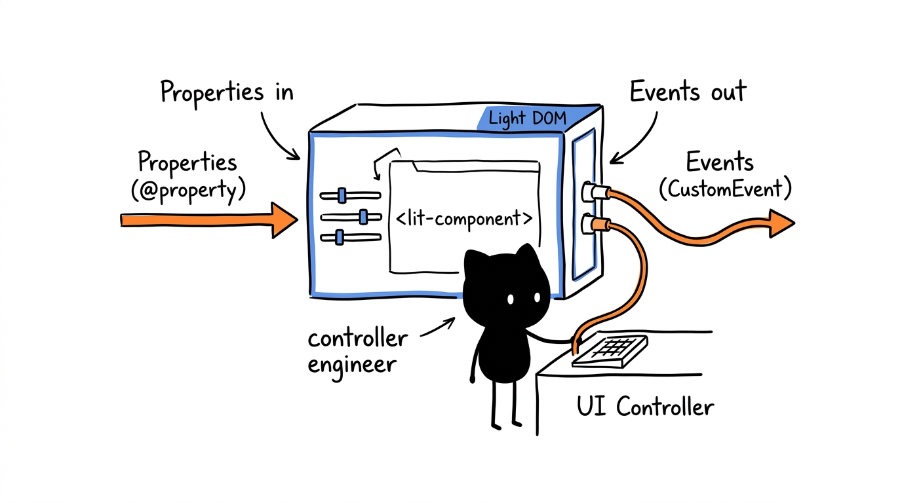
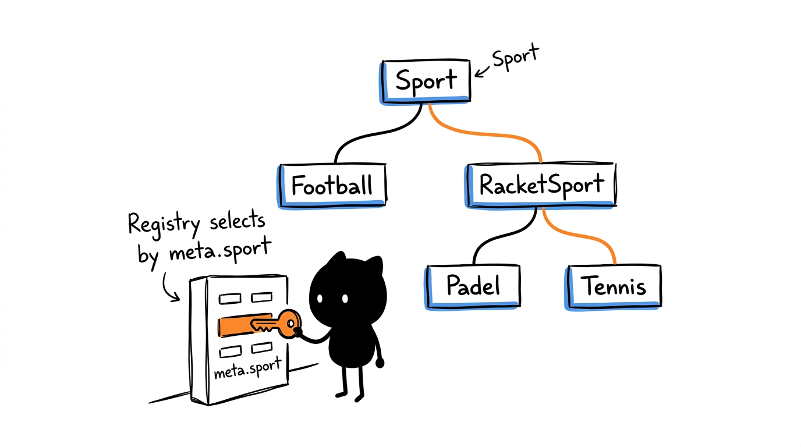
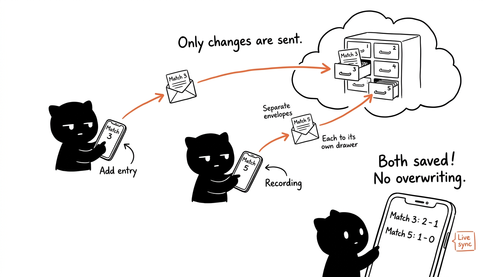
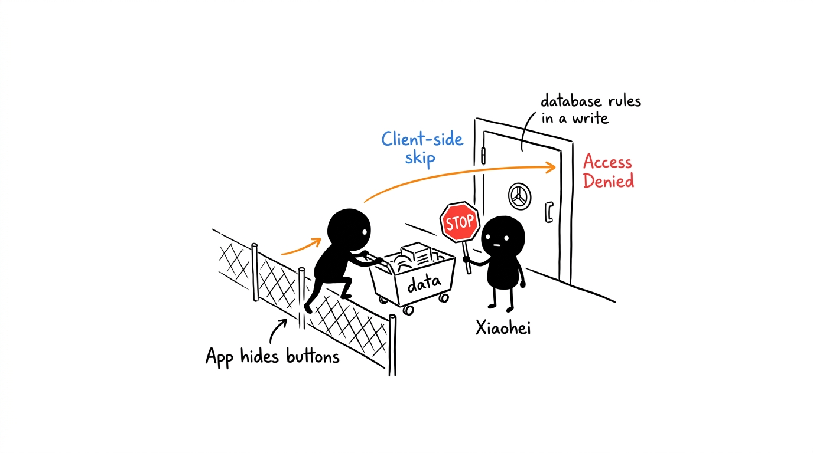
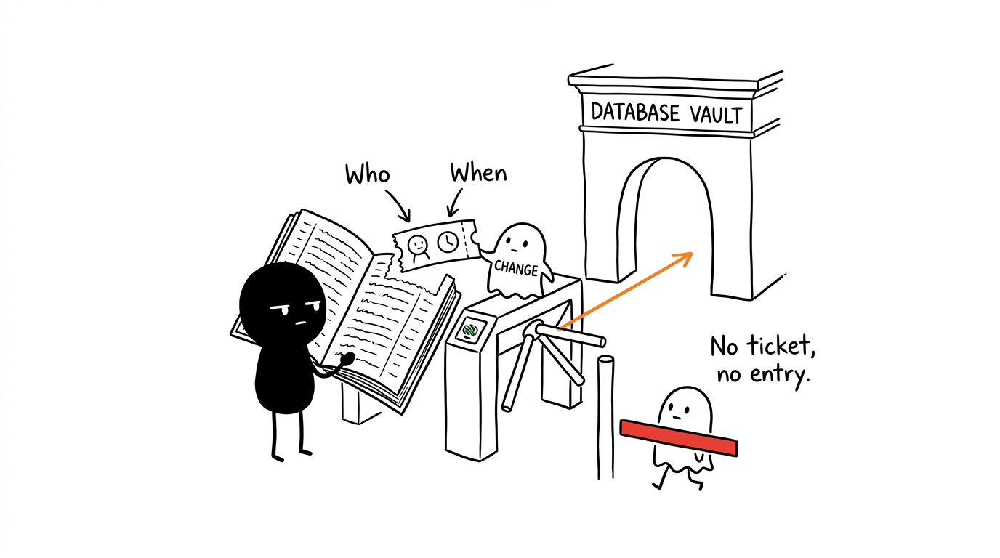

# Architecture

[← Back to the README](../README.md)

How the code is organised, how data is stored and synced, and how who-can-write-what is enforced. For code conventions and contribution rules, see also [`CLAUDE.md`](../CLAUDE.md).

- [Overview](#overview)
- [Modules](#modules)
- [Data model](#data-model)
- [Sync](#sync)
- [Permissions](#permissions)
- [Activity log](#activity-log)
- [Changing the state shape](#changing-the-state-shape)
- [HTML safety](#html-safety)
- [Tests](#tests)

## Overview

It is a single page app in TypeScript and JavaScript (ES Modules) with no framework, built with Vite and served statically by GitHub Pages. There is no server of its own: the Firebase Realtime Database stores the state and pushes changes to every connected device, and Firebase Authentication handles the Google accounts.

```
 browser (each phone)                           Firebase
┌───────────────────────────────┐            ┌──────────────────────────────────┐
│ main.ts  events ──► state.ts  │── update ─►│ tournaments/<id>  (tournaments)  │
│              ▲         │      │            │ players           (global)       │
│ ui.ts ◄──────┘   localStorage │◄─ onValue ─│ arquivo           (history)      │
└───────────────────────────────┘            │ users             (roles)        │
                                             │ tournament_log/<id> (log)        │
                                             └──────────────────────────────────┘
                                               protected by database.rules.json
```

## Modules



| File | Role |
|---|---|
| `index.html` | Structure of every tab and modal. |
| `css/` | Styles split by area (`base.css` holds the light and dark theme variables). `style.css` only `@import`s the others, in cascade order; Vite merges everything into one file in the build. New styles go into the file for their area. |
| `src/main.ts` | Wires UI events to actions (generate schedule, record goals, create, switch and finish tournaments, …) and starts the app. Lit components emit events (`open-match`, `score-commit`, …) that bubble to their container, where `main.ts` handles them through `onEvent<T>()` (typed detail); the single match tab wires its own events (`bindSingleMatchEvents`). Remembers the last tournament viewed on the device. |
| `src/state.ts` | Global state (including the current tournament id; `loadedConfig()`, `loadedTeams()` and `loadedSquads()` return the sections handlers rely on), default values, snapshots (`buildSnapshot` / `applySnapshot`), persistence in localStorage and pushes to Firebase. Undoes local changes Firebase would not accept. Does not import `ui.ts`: notices and `renderAll` come in through `setStateHooks`, called by `main.ts` at startup. |
| `src/core/` | Core tournament logic in TypeScript: Berger, schedule, extra round and first-round seeding (`schedule.ts`), the knockout bracket and winner advancement (`playoffs.ts`), Americano / Mexicano rounds and per-player standings (`americano.ts`), ratings and draft (`draft.ts`), archive and champion (`archive.ts`). |
| `src/sports/` | Multi-sport architecture: the abstract `Sport.ts` class, the sport registry (`registry.ts`, `getSport(id)`, falling back to football), and one class per sport. `football/Football.ts` has standings, tiebreaks, playoff winner, player stats and goals. `RacketSport.ts` holds what set-based sports share (set format, set and match winner, game-by-game scoring, game-based standings), and `padel/Padel.ts` and `tennis/Tennis.ts` extend it with each sport's default format. Each sport also declares its standings columns, player leaderboards, rating attributes and whether squads use jersey numbers. The UI asks the tournament's sport (`getSport(state.meta.sport)`) instead of calling football directly. |
| `src/algorithms.ts` | Re-exports core and football functions for compatibility with existing modules. |
| `src/sync.ts` | Diffs between snapshots for `update()`, normalisation of data saved by Firebase or by older versions (config, meta, results, archive, players) and the activity log text. |
| `src/firebase.ts` | Firebase connection: listens to `tournaments/<id>`, `players` and `arquivo`, pushes changes, lists, creates and finishes tournaments, migrates legacy data, Google sign-in, user role, user list and activity log. |
| `src/permissions.ts` | Roles (`master`, `admin`, `user`), per-sport admin checks and which sections each role may write. Mirrors `database.rules.json`. |
| `src/types.ts` | TypeScript domain types (`Tournament`, `TournamentMeta`, `Config`, `Match`, `Score`, `Player`, `Team`, etc.). |
| `src/i18n/en.ts` | Every user-facing string, in English. |
| `src/ui.ts` and `src/ui/` | Controllers of every screen and modal. Each section has its own module in `src/ui/` (`tournaments.ts`, `standings.ts`, `schedule.ts`, `match.ts`, `players.ts`, `teams.ts`, `history.ts`, `stats.ts`, `settings.ts`, `singular.ts`, `admin.ts`, `modals.ts`); `dom.ts` holds the elements, the form field helpers (`fieldValue`, `setFieldValue`, `isChecked`) and `onEvent`, and `toasts.ts` the toasts. A migrated controller reads the state, sets the properties of its Lit components and handles their events; it builds no HTML. `ui.ts` has `renderAll`/`refreshComputed` and re-exports the rest, so other modules import everything from `./ui.ts`. Modules in `src/ui/` never import `ui.ts`. |
| `src/components/` | Lit components of the sections, rendered in the light DOM so the app's CSS applies (`LightElement` is their base class; `templates.ts` has the team label and colour dot). Properties in, events out: `<standings-table>`, `<stats-table>`, `<stat-cards>`, `<dashboard-podium>`, `<top-scorers>`, `<all-time-stats>`, `<archive-list>` (emits `archive-delete`), `<schedule-list>` and `<results-list>` (emit `open-match`, `status-click`, `score-step` and `score-commit`; `rounds.ts` groups the schedule by round), `<teams-editor>` (`team-change`), `<squad-list>` (`squad-remove`, `player-stats`), `<player-cards>` (`player-profile`, `player-edit`, `player-delete`), `<player-picker>` (`selection-change`), `<player-editor>`, `<draft-teams>` (`draft-goal-add`, `draft-goal-sub`, `draft-mvp`), `<single-match-history>` (`single-delete`), `<user-list>` (`role-change`), `<activity-log>` and `<tournament-list>` (`tournament-select`, `tournament-finish`). Every dialog goes through `openDialog()` in `ui/modals.ts`: a title, a Lit template as body and two buttons; `setConfirmEnabled()` lets a body hold the confirm button until its input is valid. Lit escapes every value, so they need no `escapeHtml`. |
| `src/components/ScoreBase.ts` | Lit base class of the live score panel: header, admin controls (emits `point`, `cancelled`, `started`, `finished`) and the event banners (kick-off, goal, goal cancelled, full time) with the score bump. Turned off with *reduced motion*. |
| `src/sports/football/FootballScore.ts` | `<football-score>`: the match window for football (goal banners, goals timeline, MVP and share). |
| `src/sports/RacketScore.ts` | Base of the racket match windows (sets won, a set grid with the current set highlighted, GAME / SET! banners), following the rules of its `sport`. `padel/PadelScore.ts` (`<padel-score>`) and `tennis/TennisScore.ts` (`<tennis-score>`) only name their sport. `ui/match.ts` picks the panel by sport. |
| `src/share.ts` | Draws the standings and result PNG images on a `<canvas>` and shares them. |
| `src/utils.ts` | Small helpers: `escapeHtml`, `safeColor`, team and player names (`playerName`, `buildPlayerIndex`), dates, `prefersReducedMotion`. |
| `database.rules.json` | Realtime Database security rules, published by the deployment. |
| `firebase.json` | Tells the Firebase CLI where the rules are (used by the deployment). |
| `tests/` | Vitest tests; `tests/rules/` holds the rules tests for the emulator. |

## Multi-sport architecture



Every tournament belongs to one sport (`meta.sport`), which delegates scoring, standings, leaderboards, and UI panels to a sport profile class.

### Adding a sport (checklist)

When implementing a new sport (e.g. basketball, handball, volleyball):

1. **Sport class (`src/sports/<sport>/<Sport>.ts`):**
   - Extend `Sport` (or a base like `RacketSport`).
   - Define `id`, `name`, `icon`, `ratingAttributes`, `standingsColumns`, `usesJerseyNumbers`.
   - Implement `computeStandings`, `resolveHeadToHead`, `getPlayoffWinner`, `tallyPlayerStats`, and scoring methods (`addPoint`/`removePoint` or sport-specific events).
2. **Registry (`src/sports/registry.ts`):**
   - Register the new sport with `registerSport(sportInstance)`.
3. **Live score component (`src/sports/<sport>/<Sport>Score.ts`):**
   - Create custom element `<sport-score>` extending `ScoreBase`.
   - Register it in `SCORE_PANELS` inside `src/ui/match.ts`.
4. **Translations (`src/i18n/en.ts`):**
   - Add rating attribute names (e.g. `en.players.<sport>Attributes`).
   - Add live banner text, score panel buttons, and sport-specific labels.
5. **UI & Forms (`index.html` and `src/ui/settings.ts`):**
   - Tag sport-specific settings or squad options with `data-sport-only="<sport>"`.
   - Update `populateConfigForm` in `src/ui/settings.ts` if the sport adds configurable scoring parameters.
6. **Firebase Security Rules (`database.rules.json`):**
   - Add validation rules under `tournaments/$tournamentId/results/$jogo` for the sport's score format.
   - Update `src/permissions.ts` if new data paths are introduced.
   - Add emulator test cases in `tests/rules/rules.check.mjs`.
7. **Unit tests (`tests/<sport>.test.ts`):**
   - Test standings calculation, tiebreaker chain, playoff winner determination, score formatting, and player stats tallying.
8. **Documentation:**
   - Add a column to `docs/sports.md`.
   - Document rules, scoring and formats in `docs/rules.md`.
   - Update `docs/guide.md` and `README.md`.

## Data model

Each tournament lives in its own node, `tournaments/<id>` (`default` for the tournament migrated from older versions, `t_<timestamp>` for new ones), with these sections:

| Section | Contents |
|---|---|
| `meta` | `{ name, sport, status, createdAt }`. `status` is `active` or `finished`; `sport` (`football`, `padel`, `tennis`, …) is fixed at creation. |
| `config` | Name, sport, number of teams, groups, rounds, scoring, playoffs. Padel and tennis tournaments also have `setFormat: { sets, gamesPerSet, superTieBreak }` (defaults 3, 6, true in padel; 3, 6, false in tennis). Padel also has `padelFormat` (`pairs`, `americano` or `mexicano`) and `matchPoints` (24 by default), the points each Americano / Mexicano match is played to. |
| `teams` | 32 slots `{ name, color, group }` (unused ones have an empty name). |
| `squads` | 32 lists of players per team `{ id, num, name }`. In padel a squad is a pair, and in tennis one player or a pair; `num` (1, 2) only keeps the order. |
| `schedule` | List of matches `{ jornada, home, away, group }`; playoff matches have `isPlayoff`, `playoffMatchId` and `nextMatchId`. In padel Americano / Mexicano each team slot is one player: `home` and `away` are the first player of each pair and `partners: { home, away }` the second. |
| `roundsMeta` | One entry per matchday, with the team that has a bye. |
| `scheduleTeamCount`, `scheduleVoltas` | Teams and rounds the schedule was generated with. |
| `results` | By the match's index in `schedule`: `{ score: "2-1", status, scorers: { home, away }, assists: { home, away }, mvp, penalties }`. In padel and tennis `score` holds the games of each set (`"6-4 3-6 10-7"`) and there are no scorers, assists or penalties; the rules only accept that format in tournaments whose `meta.sport` is `padel` or `tennis`. |
| `jogosSingulares` | Older saves only: single matches, now in the root `singleMatches` node. The Master Admin's first load moves them there. |
| `version`, `exportedAt` | Format version (`SNAPSHOT_VERSION`, currently 13) and date of the last save. |
| `logRef` | Key of the `tournament_log/<id>` entry of the last save (see [Activity log](#activity-log)). |

Shared by every tournament, at the root of the database:

| Node | Contents |
|---|---|
| `players/<id>` | Global players database, keyed by player id: `{ id, nome, teamIdx, ratings: { <sport>: attributes }, atributos }`. Each sport has its own attribute keys (`Sport.ratingAttributes()`: football `velocidade`, `finalizacao`, …; padel `volley`, `smash`, `lob`, `walls`, `defense`, `fitness`; tennis `serve`, `return`, `forehand`, `backhand`, `volley`, `fitness`). `atributos` is a copy of the football ratings, kept for older data. |
| `arquivo/<id>` | Archived tournaments, keyed by id: name, sport, date, champion, final tables and per-player stats. |
| `singleMatches/<id>` | Single matches (a football feature, not tied to a tournament), keyed by id: both teams, score, scorers, assists and MVP. Only football admins and the Master Admin can read them. |
| `users/<uid>` | Name, email, photo, last access, `role` (`master`, `admin` or `user`; none = pending) and `admin: { <sport>: true }` for per-sport admins. |
| `tournament_log/<id>` | Activity log of each tournament. |

Notes:

- `results` is indexed by the match's **position** in `schedule`. That is why the extra round and the playoffs append matches at the end and never reorder existing ones.
- In `scorers`, `'auto'` is an own goal. `assists` is aligned with `scorers` (same position = same goal; `''` = no assist).
- Player names in `arquivo` are copied when archiving, so the history survives deleted players.
- In the app, the snapshot of the current tournament also carries `players`, `arquivo` and `jogosSingulares`; `pushStateToFirebase` writes them to the root nodes one record at a time (`keyedUpdates`, and `playerUpdates`, which also splits a player edit per field and per sport's ratings), so the rules can check each change. Ratings the player editor only filled in with zeros, for a sport the writer does not administer, are left out, so renaming or adding a player never touches another sport. Older saves stored players and the archive as arrays: the Master Admin's first load rewrites them keyed by id (`migrateGlobalRecords`), and until then other admins' player and archive saves are refused with a toast.
- A tournament exists only once it is created (`createTournament`). While the id being viewed has no node (no tournament yet, or the last one was removed), the app shows an empty tournament but saves only `players` and `arquivo`, with no `tournament_log` entry since there is no tournament to log against; any change to the tournament itself is refused with a toast, so it is never created with default settings and listed as active.
- Legacy nodes from before multiple tournaments (`torneio_state`, `torneio_log`, `utilizadores`) are read-only. `firebase.ts` falls back to `torneio_state` while `tournaments/default` does not exist (only the Master Admin and football Admins may read it, since it holds old single matches), and migrates it the first time a Master Admin signs in (see [Setup](configuration.md#setting-up-firebase-once)).

Each device also keeps a copy in localStorage, to show the tournament as soon as it opens, before Firebase replies, and remembers the last tournament viewed.

## Sync



1. On startup, `firebase.ts` listens to `tournaments/<id>` of the selected tournament with `onValue` (plus `players` and `arquivo`, and `singleMatches` for football admins). Each time a value arrives, `applySnapshot` replaces the local state and that snapshot becomes the "last synced" one. Switching tournament restarts the listener on the new node.
2. Each action saves its section to localStorage and calls `pushStateToFirebase` with the full snapshot.
3. `diffSnapshot` compares it with the last synced snapshot and produces an `update()` with only what changed:
   - `results` goes **match by match** (`results/<index>`), so that two people recording different matches at the same time do not overwrite each other;
   - `schedule` goes field by field per match (`schedule/<index>/<field>`), so that advancing a playoff winner only writes `home` or `away`;
   - the other sections go whole; if two people change the same section at the same time, the last one wins.
4. The same `update()` appends the entry to `tournament_log/<id>`, so the change and the log entry are saved together (or neither is).

Firebase deletes empty lists and turns arrays into objects with numeric keys. `normalizeResults`, `normalizeArquivo` and `normalizePlayers` restore the expected shape on load; `normalizeConfig` and `normalizeMeta` fill in defaults for data saved by older versions.

## Permissions



The Firebase rules are the real protection; the client only hides buttons and warns before sending. "Sport admin" below means a user with `role: "admin"` and `admin/<sport>: true` for the tournament's sport.

| Path | Read | Write |
|---|---|---|
| `tournaments/<id>` | Everyone | `exportedAt`, `version`: User, sport admin and Master Admin. `results`, `schedule`, `meta` and the other sections: sport admin and Master Admin. `meta/sport` cannot change. |
| `players` | Everyone | Adding a player: any Admin, with ratings only for their own sports. Name and team: any Admin. `ratings/<sport>`: that sport's admins (`atributos`: football admins). Deleting a player or rewriting the whole node: Master Admin. |
| `arquivo` | Everyone | Each entry: Master Admin or an admin of the entry's sport, which cannot be changed to another sport (entries saved without a sport count as football). The whole node: Master Admin. |
| `singleMatches` | Football admins and Master Admin | Football admins and Master Admin, one match at a time. |
| `users` | Master Admin (all); each user their own | Each user their own name, email, photo and last access; `role` and `admin`: Master Admin only. |
| `tournament_log/<id>` | Master Admin and the tournament's sport admins | User, Admin and Master Admin, new entries only, with their own `uid` and the server time. |
| `torneio_state` | Master Admin and football Admins (it holds old single matches) | Nobody. |
| `torneio_log`, `utilizadores` | Legacy | Nobody. |

Besides who can write, the rules validate what is written: scores in the `"2-1"` format, known statuses (`agendado`, `decorrer`, `terminado`), per-side lists of scorers and assists, the fields of `meta`, and length-limited text. Every write to a tournament's sections (other than `exportedAt` and `version`) must also bring a new `logRef` (see [Activity log](#activity-log)).

In the app, anyone who is not an admin of the tournament's sport sees Teams, Squads and Players read-only, with a note explaining why, and does not see the Results tab, sees scores and match status read-only in the Schedule and the match window, and cannot pick the MVP; Pick MVP only appears when an admin opens the match from Results; the 👮 Users tab is only shown to the Master Admin; the ⚽ Single Match tab only to football admins and the Master Admin; deleting a player only to the Master Admin.

**Changing permissions:** change `database.rules.json` and `src/permissions.ts` (`USER_SECTIONS`, `canWritePath`, `canWriteGlobalPath`) together, update `tests/permissions.test.js` and `tests/rules/rules.check.mjs`, and run `npm run test:rules`. The rules are published by the next deployment (see [Deployment](configuration.md#deployment)).

If Firebase rejects a write the client let through, the server value comes back by itself and the app warns: "The change was rejected by the database (permission denied). It has been reverted."

When the client knows before sending that the change is not allowed (not signed in, no role, or an admin-only section), it sends nothing: `state.ts` goes back to the last synced snapshot and shows the reason. If nothing has synced yet, or Firebase refuses a save the client did send, the app reads the tournament from Firebase again (`resyncFromServer`) and stores that, so a refused change does not stay on screen or in the local cache. Only the latest value from Firebase is applied: a refused save fires its optimistic value and then the server value, and the older one is skipped.

## Activity log



`describeUpdates` (in `sync.ts`) turns each `update()` into a readable sentence (for example, "Teams updated", or the match whose result changed). The entry `{ uid, nome, acao, quando }` goes to `tournament_log/<id>`. Creating, finishing and migrating tournaments and changing roles are logged too. The Master Admin sees the last 200 entries of the tournament being viewed in Manage → 👮 Users.

The log is mandatory, not just a client convention: the same `update()` writes `tournaments/<id>/logRef` with the key of the new entry, and the rules only accept the write if that entry is new, belongs to the user and the `logRef` changes. A write without a log entry is rejected.

## Changing the state shape

Any change to the state shape (new field, new section, different format) must:

1. Bump `SNAPSHOT_VERSION` in `src/state.ts`.
2. Keep loading data saved by earlier versions, already in Firebase and on phones (defaults in `applySnapshot`, normalisation in `sync.ts`).
3. For a new section in `tournaments/<id>`, decide who may write it (see [Permissions](#permissions)). By default it is admin-only.

## HTML safety

Anyone with the public config can try to write to Firebase, so everything that comes from the state is treated as untrusted:

- Every state value that goes into an HTML string goes through `escapeHtml`.
- Team colours go through `safeColor`.

## Tests

```bash
npm run lint         # ESLint (eslint.config.mjs)
npm run typecheck    # TypeScript type check (tsc --noEmit)
npm test             # app logic
npm run test:rules   # Firebase rules in the emulator (needs Java)
```

`npm test` runs without a browser or Firebase (Firebase and the DOM are mocked where needed):

| File | Covers |
|---|---|
| `tests/football.test.ts` | Football logic: standings, head-to-head, playoff winner, player stats, goals, animation events, rank moves |
| `tests/padel.test.ts` | Padel logic: set format, parsing sets, set and match winner, adding and removing games, super tie-break, game-based standings and head-to-head, playoff winner, animation events |
| `tests/tennis.test.ts` | Tennis: registry, default format with a full deciding set, best of 5, scoring a three-set match, games in the standings |
| `tests/core/` | Core logic: `schedule.test.ts` (Berger, rounds, seeding), `draft.test.ts` (ratings per sport, drafts, balanced pairs), `archive.test.ts` (archive), `playoffs.test.ts` (bracket, seeds, winner advancement), `americano.test.ts` (partner rotation, Mexicano pairing, player standings, padel played to points) |
| `tests/sync.test.ts` | `diffSnapshot`, `normalizeResults`, `onlyMetadata`, `describeUpdates`, `normalizeArquivo`, `normalizeConfig`, `normalizeMeta`, `keyedUpdates`, `playerUpdates`, `isKeyedById`, `keyById`, `normalizeSingleMatches` |
| `tests/state.test.ts` | `SNAPSHOT_VERSION`, `applySnapshot` with version 7 to 10 snapshots (meta derived for older ones), `buildSnapshot`, `defaultConfig`, `defaultMeta`, current tournament id |
| `tests/players.test.ts` | `defaultPlayerAttrs`, `normalizePlayer`, `normalizePlayers` and per-sport ratings in `applySnapshot` |
| `tests/torneios.test.ts` | Active tournament filter and sport badge (`src/components/TournamentList.ts`), the header (`src/ui/tournaments.ts`) and the last tournament viewed on the device |
| `tests/permissions.test.js` | `canWritePath`, `canWriteGlobalPath`, `canSeeSingleMatches`, `blockedPaths`, `roleLabel`, `isMaster`, `isSportAdmin` |
| `tests/utils.test.js` | `escapeHtml`, `safeColor` |

The core and sports modules do not depend on the UI or Firebase, so the tests import them directly. There are no circular imports: `ui.ts` does not import `main.ts` and `state.ts` does not import `ui.ts`; keep it that way when adding code. The UI is checked by hand (see [Running locally](configuration.md#running-locally)).

`npm run test:rules` starts the Realtime Database emulator with `database.rules.json` and runs `tests/rules/rules.check.mjs`: who can write each path, the validations and the `logRef`. It uses the config in `tests/rules/firebase.json`, separate from the root one.

CI runs everything before each deployment: the rules in the `rules` job, and ESLint, the type check and the logic tests in the `deploy` job.
