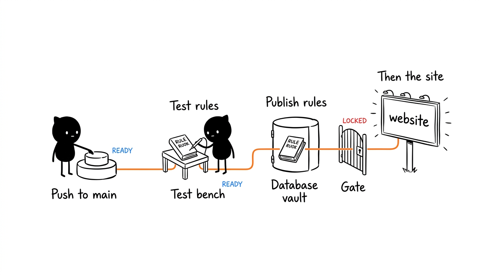

# Setup and Deployment

[← Back to the README](../README.md)

How to get the app running: the Firebase project, the environment variables, local development and deployment to GitHub Pages.

- [Requirements](#requirements)
- [Setting up Firebase (once)](#setting-up-firebase-once)
- [Environment variables](#environment-variables)
- [Running locally](#running-locally)
- [Deployment](#deployment)
- [Common problems](#common-problems)

## Requirements

- Node.js 20 (the version used in CI)
- A Firebase project with **Realtime Database** and **Authentication**
- Optional: the [Firebase CLI](https://firebase.google.com/docs/cli) and Java (CI uses Java 21), for the emulators and for `npm run test:rules`

## Setting up Firebase (once)

1. **Authentication → Sign-in method:** enable **Google**.
2. **Authentication → Settings → Authorized domains:** add `dioogomartiins.github.io` (and `localhost` for development, which is usually already there).
3. **Realtime Database → Rules:** nothing to do by hand. The deploy publishes [`database.rules.json`](../database.rules.json) by itself (see [Deployment](#deployment)); you only need to create the service account described there.
4. **Master Admin:** open the site, sign in with Google, and then in **Realtime Database → Data** create `users/<your uid>/role` with the value `"master"` (the uid is shown in Authentication → Users). From then on, the other roles (User, per-sport Admin) are assigned in the app itself, in Manage → 👮 Users.

**Data saved by older versions.** Before multiple tournaments, the whole state lived in `torneio_state` and roles in `utilizadores/<uid>/role`. When a Master Admin signs in and `tournaments/default` does not exist yet, the app copies `torneio_state` into `tournaments/default`, moves the archive to `/arquivo` and the players to `/players` (their attributes become the football ratings). Every time a Master Admin signs in, the app also copies the roles from `utilizadores` to `users` for anyone who has no role there yet: an old `admin` becomes a football Admin and an old `user` stays a User. Profiles are not copied; each person's name and photo appear the next time they sign in. The old nodes stay in the database, read-only.

The rules are published automatically on every release tag (`release/*`) before the site (or via *workflow_dispatch*). Do not edit them in the console: the next deployment overwrites whatever is there. To publish them by hand (for example, to test on your own Firebase project), use `npx firebase-tools deploy --only database --project <id>`.

## Environment variables

`.env.example` lists the variables the app reads:

| Variable | Where to find it |
|---|---|
| `VITE_FIREBASE_API_KEY` | Firebase console → Project settings → Your apps |
| `VITE_FIREBASE_AUTH_DOMAIN` | same |
| `VITE_FIREBASE_DATABASE_URL` | Realtime Database (URL at the top of the Data page) |
| `VITE_FIREBASE_PROJECT_ID` | Project settings |
| `VITE_FIREBASE_STORAGE_BUCKET` | Project settings |
| `VITE_FIREBASE_MESSAGING_SENDER_ID` | Project settings |
| `VITE_FIREBASE_APP_ID` | Project settings |
| `VITE_FIREBASE_MEASUREMENT_ID` | Project settings (Analytics) |
| `VITE_USE_EMULATORS` | Optional. `true` connects the app to the local emulators. |

`VITE_*` variables end up in the published JavaScript, so **none of them is secret**. Data is protected by the Realtime Database rules. Even so, `.env` is in `.gitignore` and must never be committed.

## Running locally

> ⚠️ Every action in the app writes to Firebase. If the local server uses the production database, a test click changes the real tournaments on everyone's phone.

```bash
npm install
npm run dev
```

Open `http://localhost:5173/sports-tournament/` (the app is served on the same path as on GitHub Pages; the root is blank).

Pick one of these ways to stay away from the real tournaments:

**A. Test database.** Vite reads `.env.development.local` on top of `.env` in `npm run dev`. Create it with the URL of another database (for example, a second instance in the same project):

```env
VITE_FIREBASE_DATABASE_URL=https://<test-database>.firebasedatabase.app
```

**B. Firebase emulators (fully offline).**

```bash
firebase emulators:start --only database,auth --project demo-torneio
```

And in `.env.development.local`:

```env
VITE_USE_EMULATORS=true
VITE_FIREBASE_PROJECT_ID=demo-torneio
VITE_FIREBASE_DATABASE_URL=https://demo-torneio.firebaseio.com
```

Load `database.rules.json` into the emulator to test the roles. To edit you need a user with `users/<uid>/role` set (`"master"` for full access, or `"admin"` plus `users/<uid>/admin/football: true`); create it in the emulator UI.

**C. Docker Compose (fully containerized, zero local Java/Firebase install needed).**

Run both the Firebase Emulator Suite (Realtime Database + Auth + Emulator UI) and the Vite frontend inside Docker:

```bash
docker compose up -d
```

- **Torneio App**: `http://localhost:5173/sports-tournament/`
- **Firebase Emulator Suite UI**: `http://localhost:4000/` (explore database, auth users, logs)
- **Realtime Database Emulator**: `localhost:9000`
- **Auth Emulator**: `localhost:9099`

To run only the Firebase emulators in Docker while running `npm run dev` on your host machine:

```bash
docker compose up -d firebase
npm run dev
```

Data in the emulator persists in the `torneio-firebase-data` volume across container restarts. To stop containers:

```bash
docker compose down
```

**Before opening a PR:**

```bash
npm run lint         # ESLint
npm run typecheck    # TypeScript
npm test             # logic tests
npm run test:rules   # rules tests in the emulator (if you changed database.rules.json; needs Java)
npm run build        # must pass
```

And check UI changes at a phone width (about 390px) and in both themes.

## Deployment



Deployment runs through the [`.github/workflows/deploy.yml`](../.github/workflows/deploy.yml) workflow when a release tag (`release/*`) is pushed, or manually via *workflow_dispatch*. Merging or pushing to `main` does not deploy. It runs two jobs in a row:

1. **Rules (`rules`):** tests `database.rules.json` in the Firebase emulator (`npm run test:rules`) and, if it passes, publishes the rules to the Realtime Database with `firebase deploy --only database`.
2. **Site (`deploy`):** only starts if the rules were published. Installs dependencies, runs ESLint, the type check and the tests, creates `.env` from the secrets, builds, and publishes `dist/` to GitHub Pages.

The rules go first because the new site depends on them (for example, the `logRef` of the [activity log](architecture.md#activity-log)). If the rules fail, the old site stays up and nothing is left half-done. That is why changes are made on a branch with a PR, and released with a tag.

When the rules change in an incompatible way, phones with the old page open can no longer save ("The change was rejected by the database (permission denied). It has been reverted.") until they reload the page.

What must be configured on GitHub:

- **Settings → Pages → Source:** *GitHub Actions* (with *Deploy from a branch* the site serves the source code and does not work).
- **Settings → Secrets and variables → Actions → Repository secrets:**
  - a secret with the same name for each `VITE_FIREBASE_*` in `.env.example`;
  - `FIREBASE_SERVICE_ACCOUNT`: the JSON of a service account of the Firebase project (Firebase console → ⚙️ Project settings → Service accounts → Generate new private key). It is only used to publish the rules. The `firebase-adminsdk` account the console creates already has permission; if you use another one, give it the *Firebase Realtime Database Admin* role.

  They must be **repository** secrets, not only secrets of the `github-pages` environment: the rules job does not use that environment and cannot see them. Without them the deployment fails with an explicit error.

The site lives at `https://dioogomartiins.github.io/sports-tournament/` (the path comes from `base` in `vite.config.js`).

## Common problems

| Symptom | Likely cause |
|---|---|
| Blank page on the local server | You opened `localhost:5173/` instead of `localhost:5173/sports-tournament/` |
| Firebase errors in the browser console | Missing `.env` or wrong database URL |
| "Your account has not been approved by an admin yet." | The account has no role: the Master Admin must give it one in Manage → 👮 Users |
| "Only an admin can make this change." | The account is a User (or an Admin of another sport) and the change needs an admin of this tournament's sport |
| "The change was rejected by the database (permission denied). It has been reverted." | The page is out of date compared with the published rules: reload. If it persists, the account does not have the role for that change |
| Google sign-in fails on the published site | `dioogomartiins.github.io` is not in the authorized domains |
| A push to `main` did not update the site | Expected: deployment only runs on `release/*` tags or a manual run of the workflow |
| Deploy fails at "Create .env from repository secrets" | The repository's `VITE_FIREBASE_*` secrets are missing |
| Deploy fails at "Test rules in the emulator" | `database.rules.json` broke a case in `tests/rules/rules.check.mjs`; run `npm run test:rules` locally |
| Deploy fails at "Deploy database rules" | The `FIREBASE_SERVICE_ACCOUNT` secret is missing (or only in the `github-pages` environment), or the service account lacks the *Firebase Realtime Database Admin* role |
| Published site shows `Failed to resolve module specifier` | Pages is set to *Deploy from a branch* instead of *GitHub Actions* |
