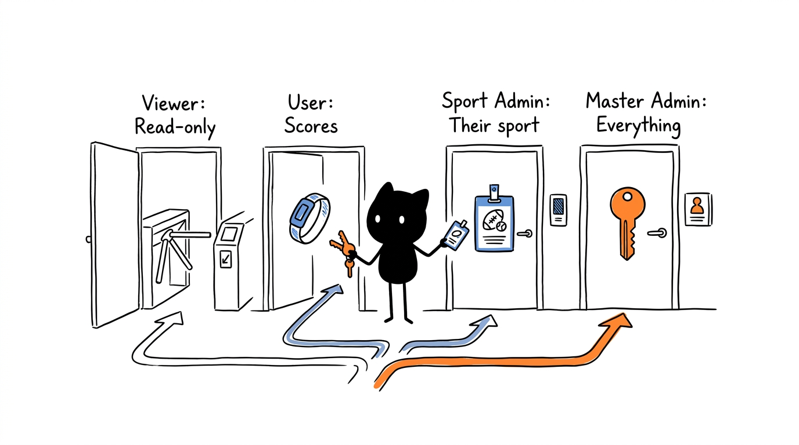
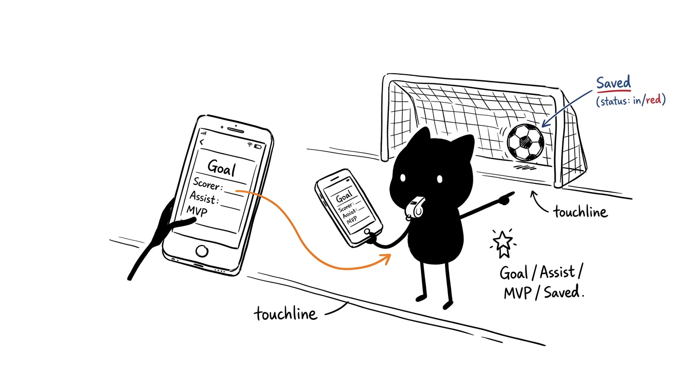
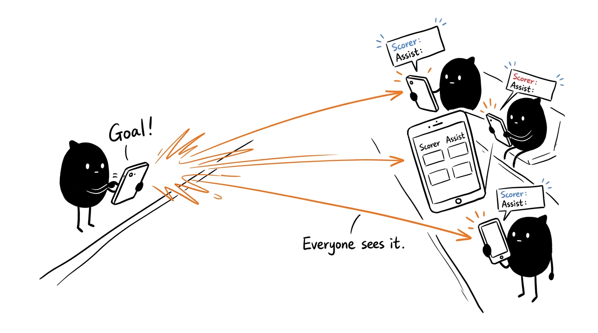
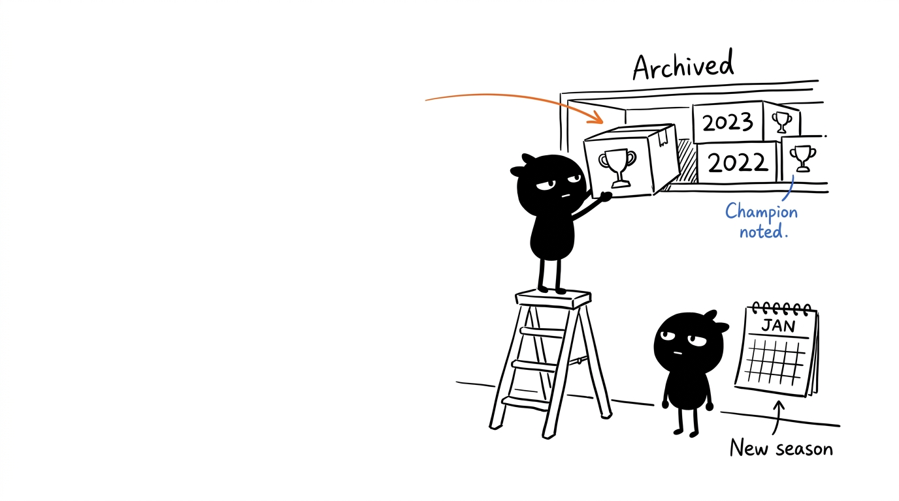
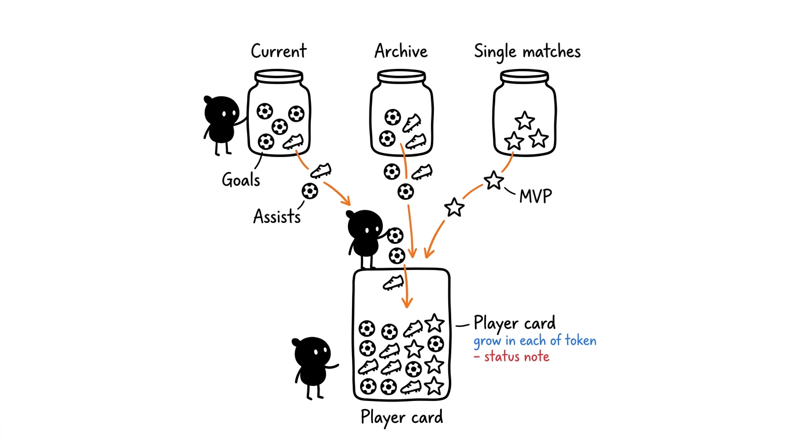

# User Guide

[← Back to the README](../README.md)

This guide explains how to use the app day to day: who can do what, how to create a tournament and take it from zero to a champion, and how to use single matches. Points, tiebreaks and balanced teams are explained in [Rules and Calculations](rules.md).

- [Accounts and roles](#accounts-and-roles)
- [App map](#app-map)
- [Tournaments](#tournaments)
- [Setting up a tournament](#setting-up-a-tournament)
- [During the matches](#during-the-matches)
- [Playoffs](#playoffs)
- [Finishing and archiving](#finishing-and-archiving)
- [Single Match](#single-match)
- [Stats, player profile and sharing](#stats-player-profile-and-sharing)
- [Data: export, import and delete](#data-export-import-and-delete)

## Accounts and roles

Anyone with the link can view the tournaments, without an account. To change anything you need to tap **🔑 Sign In**, sign in with Google, and have a role given to you by the Master Admin.

| Role | Can |
|---|---|
| **Pending** (just signed in) | Only view. Waits for the Master Admin to give them a role. |
| **User** | Record results, scorers, assists and MVP, change match status (including playoff matches) and record single matches. |
| **Admin** (per sport) | For tournaments of the sports they administer (⚽ Football, 🎾 Padel): everything else — create and finish tournaments, settings, schedule, playoffs, teams, squads, import, delete data and remove archived tournaments from History. Admins can also edit the players database. In tournaments of other sports they have no admin rights. |
| **Master Admin** | Everything, in every sport, plus managing users. |

The Master Admin assigns roles in **🛠️ Manage → 👮 Users**: pick *Pending*, *User*, *Admin* or *Master Admin* for each person and, for an Admin, tick the sports they administer. The same page has the **Activity Log**: the last 200 changes to the tournament being viewed, with who made them and when.

Buttons your role cannot use are hidden. Even if someone bypasses the app, Firebase rejects the write (see [Architecture](architecture.md#permissions)).

## App map

| Tab | What for |
|---|---|
| 🏠 Dashboard | List of active tournaments (to switch between them), plus a summary of the one being viewed: top 3 of the standings and the tournament numbers. The 🔁 button at the top refreshes the numbers. |
| 🏆 Standings | Full table (per group, with the points right after the team) and the playoff bracket. |
| 📅 Schedule | Rounds, matches and byes; generate playoffs and add rounds. Tapping a match opens the match window. |
| ⚽ Results | Where matches are recorded live. |
| 📊 Stats | Scorers, assists and MVPs of the current tournament and its single matches. |
| 🗄️ History | Archived tournaments and all-time stats. |
| ⚙️ Settings | Name, format and scoring (admins only). |
| 🛠️ Manage | 👥 Teams, 👕 Squads, 👤 Players, 💾 Data (admins) and 👮 Users (Master Admin). |
| ⚽ Single Match | One-off matches with balanced teams. |

The header shows the tournament name and its sport. The theme button switches between light and dark.

On a phone, the header is a single line pinned to the top: on the left the tournament name and the round, on the right 🔁 (refresh), the theme and the account (👤 when signed in; tapping it shows which account and role you are using before confirming the sign-out). At the bottom there is a floating navigation pill with 🏠 Home, ⚽ Results, 🏆 Standings, 📅 Schedule and ☰ More (the open tab shows its name); **More** opens a panel with the remaining tabs (Stats, History, Settings, Manage and Single Match). The "Saved ✓" notice only appears at the top right after a save or if there is an error.

## Tournaments

Several tournaments can run at the same time, each with its own sport, teams, schedule, results and single matches. The players database and the History are shared by all of them.

- **🏆 Active Tournaments** (on the 🏠 Dashboard) lists every tournament that has not been finished. Tap a card, or **👁️ View Tournament**, to follow it; the whole app then shows that tournament. Each device remembers the last tournament it viewed.
- **➕ New Tournament** (Master Admin, or an Admin of at least one sport) asks for the **Tournament Name**, the **Sport** and the **Number of Teams (2–32)**, then **Create Tournament**. The sport cannot be changed later. An Admin can only pick the sports they administer.
- **🏁 Finish Tournament** appears on the card of the tournament being viewed (for its admins): see [Finishing and archiving](#finishing-and-archiving).

## Setting up a tournament

These steps are done by an **admin** of the tournament's sport (or the Master Admin). Anyone else sees Teams, Squads and Players read-only, without edit buttons.

1. **Players** (Manage → 👤 Players): create each player and give them 0 to 5 stars in Pace, Shooting, Passing, Dribbling, Defending and Physical. Each player has a separate set of ratings per sport, chosen in **Attribute Sport** in the player window; the average is the player's ★ rating for that sport. This database is shared by every tournament and by single matches.
2. **Tournament** (🏠 Dashboard → ➕ New Tournament): create it as described in [Tournaments](#tournaments).
3. **Settings** (⚙️): set the name, the number of teams (2 to 32), the number of groups (1, 2, 4 or 8), the number of rounds, the scoring, and whether there are playoffs and how many teams qualify.
4. **Teams** (Manage → 👥 Teams): give each team a name and a colour.
5. **Squads** (Manage → 👕 Squads): pick the team and add players from the database, with their jersey number. The squad's average ★ is shown at the top.
6. **🔄 Generate Schedule** (⚙️ Settings): creates all the rounds. With more than one group, the teams are drawn into the groups at this point.

Generating a new schedule deletes the results already entered (the app asks for confirmation). Teams, squads and settings are kept.

**Extra round:** in a single-league tournament without playoffs, the **➕ Add Extra Round (Keep Results)** button in the Schedule adds one more round without losing results. The new round swaps who plays at home.

## During the matches

In the **⚽ Results** tab, each match has:

- **Status**: tapping the button cycles through *Scheduled → In Progress → Finished*. Scheduled matches do not count towards the standings.
- **＋ / −** on each side: ＋ asks who scored (or *Own Goal*) and then who assisted (or *No assist*; own goals have none). − removes that team's last goal. Scoring the first goal sets the match to *In Progress*.
- **📋 Match**: opens the match window (see below).

You can also type the score straight into the boxes; in that case no scorers are attached.

**Match window.** Opens with **📋 Match** in Results, or by tapping the match in the Schedule. It shows the score and, per team, each goal with the scorer and the assist. It updates by itself when someone records a goal on another phone. Once the match is finished, it has the **⭐ Pick MVP** and **📤 Share image** buttons (the result image).

**Live on every phone.** When a match kicks off, a goal is scored (background in the team colour, scorer and assist), a goal is cancelled or the match ends, a short animation appears on every device, and in the Standings the teams slide to their new place. If the standings changed while you were on another tab, when you open it you briefly see the order from the last time you looked and then the teams slide to their current position. Next to the position, a green (▲) or red (▼) arrow shows how many places each team gained or lost since then, and stays until the order changes again. With *reduced motion* turned on in the phone, the animations do not play.

The standings, dashboard and stats update by themselves on every device.

## Playoffs

With playoffs enabled in the settings, the **🏆 Generate Playoffs** button appears in the Schedule (for admins) once every league match is *Finished*. The app qualifies the top teams of each group from the current standings and builds the bracket (up to 16 teams: Round of 16, Quarter-Finals, Semi-Finals and Final). How teams are paired is in [Rules and Calculations](rules.md#playoffs).

A playoff match that finishes level shows the **Penalties** boxes. The winner moves automatically to the next match of the bracket.

## Finishing and archiving

When the tournament is over, an admin taps **🏁 Finish Tournament** on its card in the 🏠 Dashboard, or **Manage → 💾 Data → 🏁 Finish and Archive Tournament**. The app:

1. Saves to **🗄️ History** the final standings, the champion (winner of the final, or the league leader when there is a single group and no playoffs), the number of matches and goals, and each player's stats.
2. Marks the tournament as finished, so it leaves the active tournaments list, and switches to another active tournament (if there is one).

If there are still unfinished matches, the app warns first: the saved champion will be whoever leads at that moment, or none if the final has not finished.

Finishing does not delete anything: the finished tournament's data stays in the database, and the players database and the other tournaments are untouched. To play again, create a new tournament.

## Single Match

For when there are not enough people for a tournament:

1. Name the two teams (optional).
2. Tick the players who are there.
3. Tap **⚽ Run Draft**: the app splits them into two teams with total ratings as close as possible (using the ratings for the sport of the tournament being viewed).
4. During the match, record goals with ＋ (scorer and assist) and pick the MVP.
5. Enter the score and tap **💾 Save Match**. The match goes into the *📅 History* sub-tab of Single Match.

Single matches are saved with the tournament being viewed. Their goals, assists and MVPs count towards the stats and each player's profile.

## Stats, player profile and sharing

- **📊 Stats**: table of scorers, assists and MVPs of the current tournament and its single matches.
- **🗄️ History**: list of archived tournaments and an all-time table (archived tournaments, the current tournament and single matches).
- **Player profile**: tap a player's name to see their attributes, rating, and all-time goals, assists and MVPs.
- **Share**: the **📤** button next to the Standings title, and **📤 Share image** in the window of each finished match. On a phone it opens the system share sheet (WhatsApp, etc.); on a computer it downloads the PNG image.

## Data: export, import and delete

All in **Manage → 💾 Data** (admins only), for the tournament being viewed:

- **⬇️ Export JSON**: downloads a full copy of the state. A good idea before big changes.
- **⬆️ Import JSON**: replaces the current state with an exported file. Affects every device.
- **🏁 Finish and Archive Tournament**: see [Finishing and archiving](#finishing-and-archiving).
- **🧹 Danger Zone**: deletes, as you choose, results, schedule, or teams and squads. The players database and the single matches history are protected and cannot be deleted here.

An archived tournament can be removed from History with **🗑️ Delete from history** (admins of its sport, or the Master Admin).
