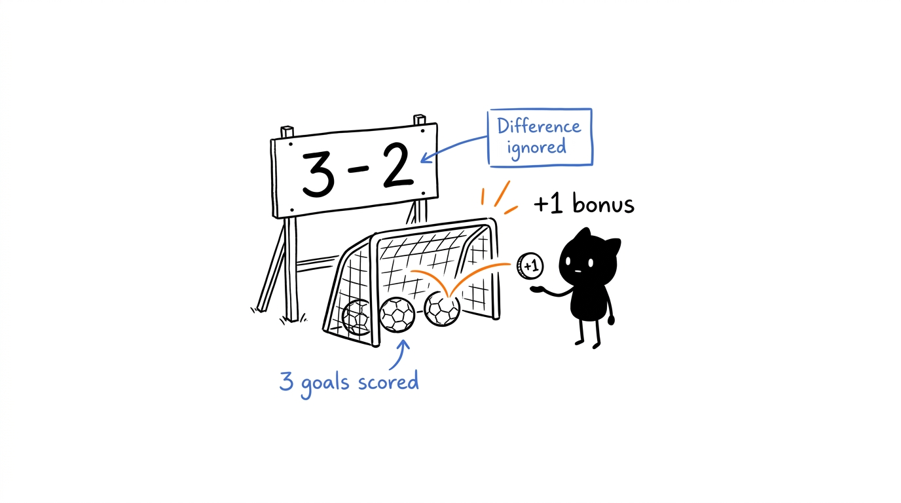
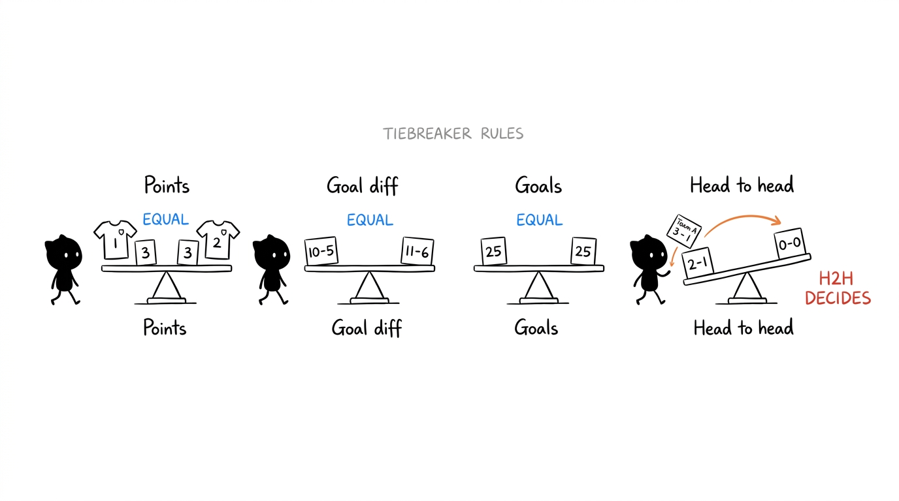
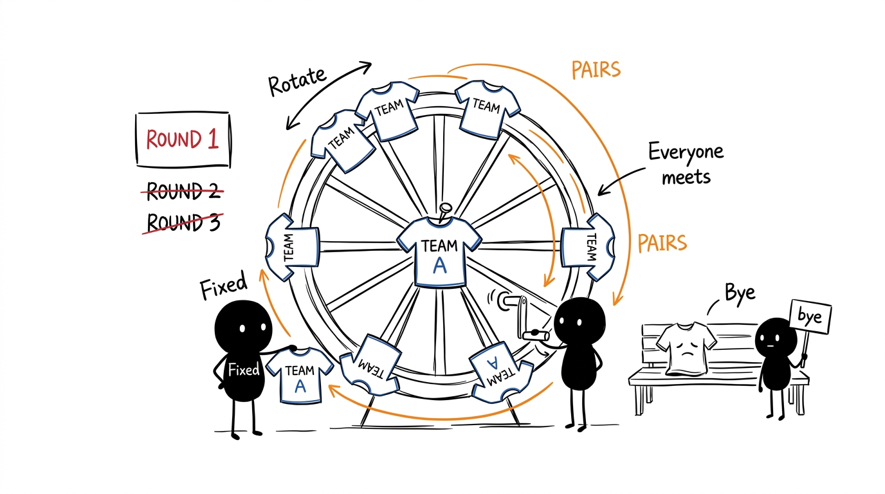
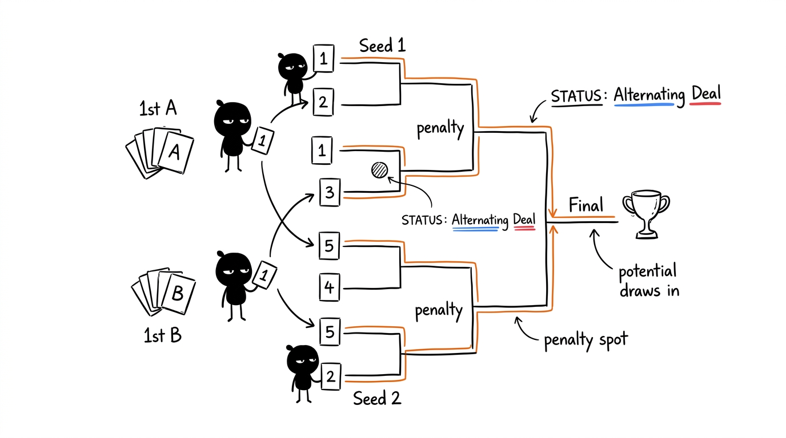
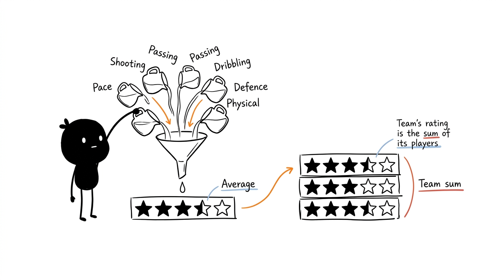
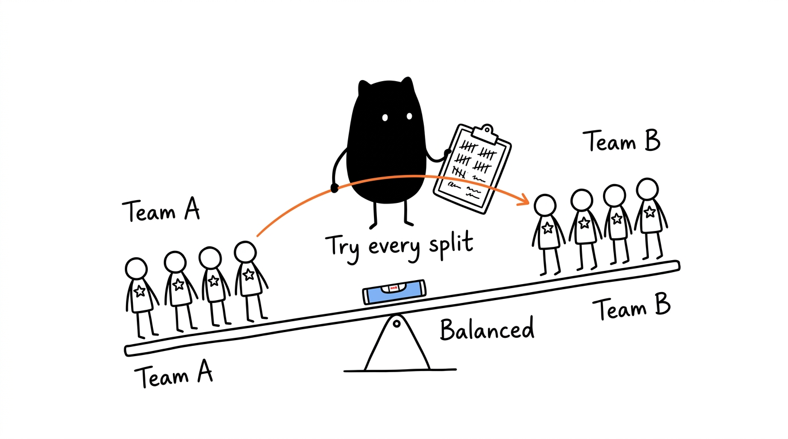

# Rules and Calculations

[← Back to the README](../README.md)

How the app gets to the numbers it shows. The schedule, draft and archive logic lives in `src/core/`, and each sport's rules (standings, tiebreaks, playoff winner, player stats) in its class: `src/sports/football/Football.ts`, and `src/sports/RacketSport.ts` with `src/sports/padel/Padel.ts`. Tests are in `tests/core/`, `tests/football.test.ts` and `tests/padel.test.ts`.

Scoring, standings and player stats depend on the tournament's sport. The schedule, groups, playoffs and champion work the same for every sport. Padel's own rules are in [Padel](#padel).

- [Scoring](#scoring)
- [Standings and tiebreaks](#standings-and-tiebreaks)
- [Schedule (Berger algorithm)](#schedule-berger-algorithm)
- [Groups](#groups)
- [Playoffs](#playoffs)
- [Champion](#champion)
- [Player rating](#player-rating)
- [Balanced teams (Single Match)](#balanced-teams-single-match)
- [Player stats](#player-stats)
- [Padel](#padel)

## Scoring

Football. Padel has no points per match (see [Padel](#padel)).

Configurable in ⚙️ Settings. Default values:

| | Points |
|---|---|
| Win | 3 |
| Draw | 1 |
| Loss | 0 |
| Bonus (blowout win) | +1 |

The **blowout bonus** goes to the team that wins scoring at least the configured number of goals (*Goals scored for bonus*, 3 by default). It counts goals scored, not the difference: a 3-2 also earns the bonus.

Only league-stage matches with a score that are not *Scheduled* count. Playoff matches do not count towards the standings.

## Standings and tiebreaks

In football, teams are ranked by:

1. Points
2. Goal difference
3. Goals scored

If two or more teams are still level on all three, they are separated by **head-to-head** (only the matches between the tied teams):

4. Points in the matches between them
5. Goal difference in the matches between them
6. Goals scored in the matches between them
7. Fewest goals conceded overall
8. Alphabetical order

With groups, each group has its own table.

## Schedule (Berger algorithm)

Each round is a single round-robin in which every team plays every other team once. The Berger algorithm fixes one team and rotates the others, which gives balanced matchdays and alternates who plays at home.

- **Odd number of teams:** on each matchday one team has a bye; the bye is shown in the schedule.
- **Several rounds:** in even rounds (2nd, 4th, …) the matches repeat with home and away swapped.
- **Extra round:** adds one more round at the end without touching existing matches (single league only, and before the playoffs), so results are kept.

A schedule with N teams has N−1 matchdays per round (N if N is odd) and N×(N−1)/2 matches per round.

## Groups

With 2, 4 or 8 groups, the teams are **drawn** into the groups every time the schedule is generated, in parts as equal as possible (the last groups may have fewer teams). Each group has its own Berger schedule, played on the same matchdays.

## Playoffs

The number of qualified teams is *qualified per group × number of groups* and must be 2, 4, 8 or 16. The bracket starts at:

| Teams | First round |
|---|---|
| 16 | Round of 16 |
| 8 | Quarter-Finals |
| 4 | Semi-Finals |
| 2 | Final |

**Seeds:** qualified teams are ordered by position, interleaving groups: 1st of A, 1st of B, …, 2nd of A, 2nd of B, … In the first round seed 1 plays the last seed, seed 2 the second-to-last, and so on, arranged so that seeds 1 and 2 can only meet in the final.

**Draws:** a playoff match that finishes level is decided on penalties. The winner moves by itself to the right slot of the next match.

## Champion

- With playoffs: the winner of the final (on penalties in football if it ends level; in padel, the pair that wins the most sets).
- Without playoffs and with a single group: the league leader.
- With several groups and no playoffs there is no automatic champion.

## Player rating

Each player has 0 to 5 stars in six attributes per sport, kept separately:

| Sport | Attributes |
|---|---|
| ⚽ Football | Pace, Shooting, Passing, Dribbling, Defending, Physical |
| 🎾 Padel | Volley, Smash, Lob, Wall play, Defense, Fitness |

The **★ rating** is the average of that sport's six attributes for the tournament's sport, with one decimal place. A player never rated in a sport has ★ 0.0 there. A team's rating is the sum of its players' ratings.

## Balanced teams (Single Match)

**⚽ Run Draft** splits the players who are there into two teams, using their rating for the sport of the tournament being viewed:

- The teams get the same number of players, or one apart if the total is odd.
- **Up to 20 players**, the app tries every possible split and keeps the one with the smallest total rating difference.
- **More than 20**, it starts from a *snake draft* (A, B, B, A, A, B, …, in rating order) and keeps swapping pairs of players between the teams while the difference goes down.

## Player stats

For each player the app counts:

| Stat | How it is counted |
|---|---|
| Goals | Each goal recorded with that scorer (own goals count for nobody) |
| Assists | Each goal where they were picked as the assist |
| MVP | Matches in which they were the MVP |
| Scoring matches | Matches in which they scored at least one goal |
| Record | Most goals in a single match |

The Stats tab adds up the current tournament and its single matches. History and the player profile also add the archived tournaments.

## Padel

Padel is scored **game by game**: no 15-30-40 points. A score is saved as the games of each set, e.g. `6-4 3-6 10-7`.

### Set format

Set per tournament in ⚙️ Settings → *Set format*. Defaults are in brackets.

| Setting | Values |
|---|---|
| Sets per match | 1, best of 3 [3], best of 5 |
| Games per set | 1 to 9 [6] |
| Super tie-break in the deciding set | on [on] / off |

- A set is won by reaching the games per set with a 2-game lead (6-4), or 7-6 with 6 games per set.
- The **super tie-break** replaces the deciding set (the 3rd of 3, the 5th of 5). It is played to 10 points with a 2-point lead and is entered with the same − / + buttons.
- The match ends when a pair has won the majority of the sets. After that, + does nothing.

### Standings

There are no points per win. Pairs are ranked by:

1. Games won (**GW**)
2. Game difference (**GD**)
3. Head-to-head: games won, then game difference, in the matches between the tied pairs
4. Fewest games lost (**GL**)
5. Alphabetical order

A super tie-break counts as **one game** for the pair that wins it (10-7 counts as 1-0), so it does not outweigh a whole set. The table also shows matches played (P), won (W) and lost (L).

### Pairs

Each team is a pair of two players, without jersey numbers. In 👕 Squads an admin can:

- **Fix the pairs:** add two players to each team.
- **🎲 Draw pairs:** tick exactly two players per team. The players are sorted by padel rating, and the best is paired with the weakest, the second best with the second weakest, and so on. The pairs fill the teams in order, each team is renamed after its pair (e.g. "Rui / Nuno"), and the existing pairs are replaced.

### Stats

Padel records no goals, assists or MVP. The Stats tab shows games played, games per match, most games won, fewest games lost, the biggest win (by game difference) and most wins.
