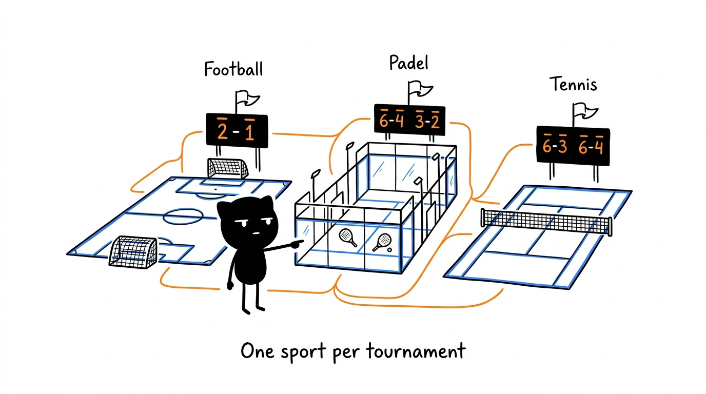

# Sports

Every tournament has one sport, chosen when it is created and fixed afterwards (`meta.sport`). The sport decides how a match is scored, how the standings are ranked, what the match window shows and which player ratings are used. The schedule, groups, playoffs, archive and permissions work the same for every sport.

| | ⚽ Football | 🎾 Padel | 🎾 Padel Americano / Mexicano | 🎾 Tennis |
|---|---|---|---|---|
| **Score** | Goals, `3-1` | Games of each set, `6-4 3-6 10-7` | Points to a total, `15-9` of 24 | Games of each set, `6-4 6-7 7-5` |
| **Entered** | ＋ / − per goal (scorer and assist) or typed | ＋ / − one game | ＋ / − one point | ＋ / − one game |
| **Default format** | Configurable points per win, draw and loss, blowout bonus | Best of 3, 6 games, super tie-break | 24 points per match | Best of 3, 6 games, full deciding set |
| **Draws** | Yes (penalties in playoffs) | No | Yes (equal points) | No |
| **Ranked by** | Pts → GD → GF → head-to-head | Matches won (Win points, 1 by default) → set difference → game difference → head-to-head | Points won → point difference → wins | Matches won (Win points, 1 by default) → set difference → game difference → head-to-head |
| **Team** | A squad with jersey numbers | A pair, fixed or drawn by rating | One player; partners rotate every round | One player (singles) or two (doubles) |
| **Player stats** | Goals, assists, MVP | Games (no player events) | The standings are per player | Games (no player events) |
| **Player profile** | Matches, wins, goals, assists, MVP, scoring matches, record | Matches, wins | Matches, wins | Matches, wins |
| **Ratings** | Pace, Shooting, Passing, Dribbling, Defending, Physical | Volley, Smash, Lob, Wall play, Defense, Fitness | Padel ratings | Serve, Return, Forehand, Backhand, Volley, Fitness |
| **Match window** | `<football-score>` | `<padel-score>` | `<padel-score>` (points) | `<tennis-score>` |
| **Rules** | [Rules](rules.md#scoring) | [Padel](rules.md#padel) | [Americano and Mexicano](rules.md#americano-and-mexicano) | [Tennis](rules.md#tennis) |

## Admins per sport

An **Admin** manages the tournaments of the sports ticked for them in 👮 Users (`users/<uid>/admin/<sport>`), and only those: an admin of padel cannot change a football tournament. The **Master Admin** manages every sport. See [Accounts and roles](guide.md#accounts-and-roles).

## Code

Each sport is a class in `src/sports/` registered in `src/sports/registry.ts`: `football/Football.ts`, and the set-based sports on `RacketSport.ts` (`padel/Padel.ts`, `tennis/Tennis.ts`). Each has its own match window component next to it, and the racket ones share `RacketScore.ts`. Americano and Mexicano are padel formats (`config.padelFormat`) with their logic in `src/core/americano.ts`. See [Architecture](architecture.md) and, for adding a sport, [Multi-Sport](multi-sport.md).

## Planned

Basketball 🏀 ([#59](https://github.com/dioogomartiins/sports-tournament/issues/59)), handball 🤾 ([#60](https://github.com/dioogomartiins/sports-tournament/issues/60)) and volleyball 🏐 ([#61](https://github.com/dioogomartiins/sports-tournament/issues/61)) are planned, each with its own rules, score component and tests.
